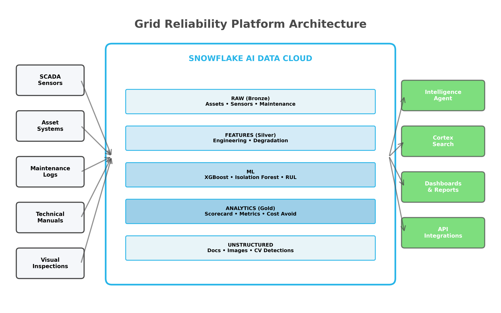
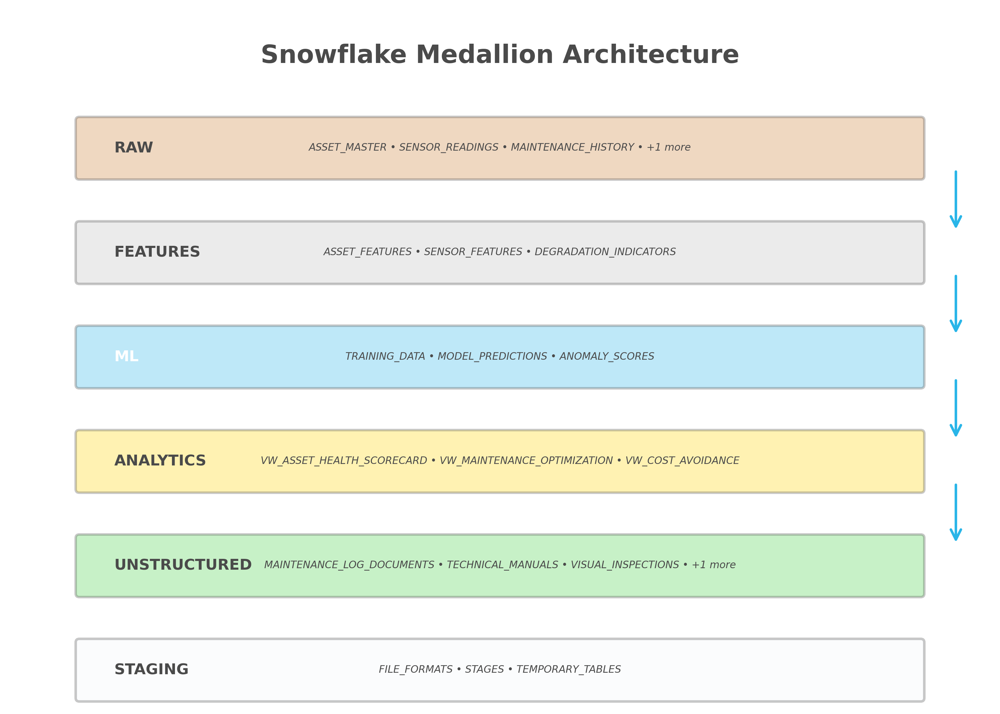
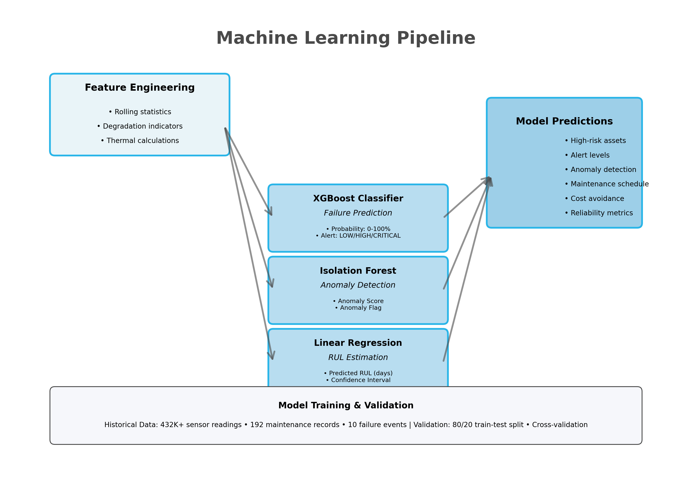
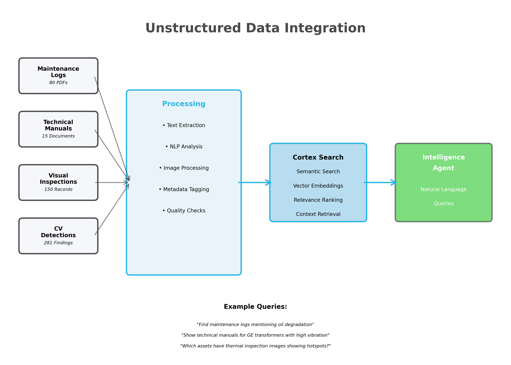
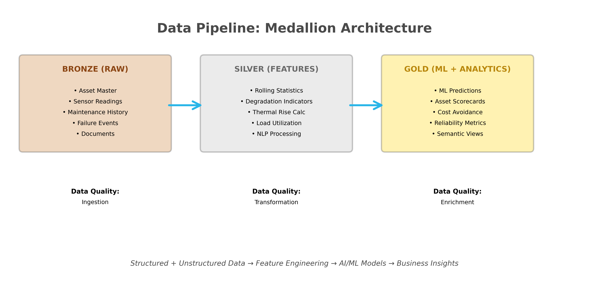

# Grid Reliability & Predictive Maintenance: AI-Powered Asset Intelligence on Snowflake

**Transform Grid Operations with Intelligence-Driven Predictive Maintenance**

---

## Executive Summary

The Grid Reliability & Predictive Maintenance Platform is a comprehensive, AI-powered solution built on Snowflake that enables utilities to predict equipment failures, optimize maintenance schedules, and maximize asset reliability. By leveraging machine learning, natural language AI agents, and real-time analytics across both structured and unstructured data, utilities can transition from reactive to predictive maintenance, reducing outages, extending asset life, and delivering measurable improvements in reliability metrics (SAIDI/SAIFI).

**Key Capabilities:**
- 360-degree asset health monitoring with comprehensive sensor intelligence
- Machine learning models for failure prediction and remaining useful life (RUL) estimation
- Unstructured data integration (maintenance logs, technical manuals, visual inspections, CV detections)
- Natural language querying via Snowflake Intelligence Agents
- Unified analytics across IT and OT data systems
- Real-time insights for proactive maintenance planning

---

## 1. The Business Challenge

### Modern Utility Grid Operations Face Critical Challenges

Utilities today manage increasingly complex grid infrastructure while facing unprecedented reliability pressures:

**Aging Infrastructure**
- 40% of transformers and circuit breakers are >20 years old*
- Traditional 25-year design life under stress from increased loading
- Delayed failures create customer impact and reliability penalties

**Reactive Maintenance Is Costly**
- 60-70% of failures occur despite calendar-based maintenance*
- Emergency replacements cost 3-5x more than planned maintenance
- Average transformer failure: $385K cost, 4.2 hours outage, 8,500 customers affected*

**Data Silos Prevent Intelligence**
- OT sensor data trapped in SCADA systems
- IT asset data in separate enterprise systems  
- Maintenance logs and technical manuals in unstructured formats
- Visual inspection data (drone, thermal imaging) not analyzed
- No unified analytics platform

**Regulatory Pressure**
- State commissions closely monitor SAIDI/SAIFI metrics
- Penalties for poor reliability performance
- Pressure to justify rate cases with performance improvements

**Climate & Load Growth**
- Extreme weather events increasing thermal stress
- EV adoption and electrification driving unprecedented load growth
- Severe weather requiring more resilient infrastructure

> *Statistics represent industry averages compiled from: U.S. Department of Energy Grid Modernization Reports, Electric Power Research Institute (EPRI) Asset Management Studies, and utility industry surveys. Specific metrics vary by utility and region.

---

## 2. The Solution: AI-Powered Predictive Maintenance

The Grid Reliability Platform transforms raw operational data into actionable asset intelligence through Snowflake's unified data cloud.

### Architecture Overview

The platform implements a modern **Medallion Architecture** across Snowflake:

**RAW Layer** - Data ingestion from all asset touchpoints:
- SCADA sensor data (temperature, load, vibration, acoustic, DGA)
- Asset master data (transformers, circuit breakers, substations)
- Maintenance history and work orders
- Failure event records
- Unstructured documents (PDFs, images, videos)

**FEATURES Layer** - Data quality and feature engineering:
- Rolling statistics and degradation indicators
- Thermal rise calculations
- Load utilization patterns
- Maintenance frequency analysis
- Document text extraction and NLP processing

**ML Layer** - Machine learning models:
- XGBoost classifier for failure prediction
- Isolation Forest for anomaly detection
- Linear regression for remaining useful life (RUL) estimation
- Model predictions with confidence scores and alert levels

**ANALYTICS Layer** - Business-ready aggregations:
- Asset health scorecards
- Cost avoidance calculations
- Reliability metrics (SAIDI, SAIFI, CAIDI)
- High-risk asset monitoring
- Maintenance optimization insights

**UNSTRUCTURED Layer** - Document intelligence:
- Maintenance log documents (PDFs with NLP-ready text)
- Technical manuals (equipment specifications, troubleshooting guides)
- Visual inspection records (drone, thermal, visual, LiDAR)
- Computer vision detections (corrosion, cracks, hotspots, oil leaks)

**Semantic Layer** - Natural language interface:
- Business-friendly semantic views
- Snowflake Intelligence Agents for conversational analytics
- Cortex Search for unstructured data

---

## 3. Business Value & ROI

### Potential Impact (Industry Benchmarks)

> **Important:** The following metrics represent **industry benchmark ranges** compiled from utility technology ROI studies, academic research, and vendor case studies. These are **estimates** and not guaranteed outcomes. Actual results will vary significantly based on:
> - Size and condition of existing asset base
> - Current maintenance maturity and practices
> - Quality of historical data available
> - Implementation approach and organizational change management
> - Specific use cases and asset types deployed
>
> **Sources:**
> - Electric Power Research Institute (EPRI) - Predictive Maintenance Studies (2020-2023)
> - Deloitte - "Predictive Maintenance and the Smart Factory" Report
> - McKinsey - "Maintenance and Reliability Best Practices" Analysis
> - GE Digital - Gas Turbine Fleet Predictive Maintenance Results (64% forced outage reduction)
> - IEEE Power & Energy Society - Grid Modernization Case Studies

**Cost Avoidance Potential**
- **$15M-$30M annual savings** from prevented failures and optimized maintenance (varies by utility size)
- **30-50% reduction** in emergency maintenance costs
- **20-40% reduction** in total maintenance spend through schedule optimization
- **5-7 year extension** of asset lifespan through condition-based maintenance

**Reliability Improvement Potential**
- **50-70% reduction** in unplanned outages through early failure detection
- **15-25% improvement** in SAIDI/SAIFI reliability scores
- **Up to 64% reduction** in forced outages (documented in GE gas turbine fleet study)
- **60-80% of failures** detectable 14-30 days in advance with mature models

**Operational Efficiency Potential**
- **40-60% improvement** in maintenance workforce productivity
- **50-70% faster** response to asset degradation indicators
- **30-50% reduction** in manual data analysis time
- **Near real-time visibility** into thousands of critical assets

**Regulatory & Customer Benefits**
- Improved regulatory standing with state utility commissions
- Data-driven justification for infrastructure investments and rate cases
- Measurable customer satisfaction improvements through reduced outage frequency
- Enhanced stakeholder communication with predictive insights

### Example ROI Scenario

The following is an **illustrative example** for a mid-sized utility with 5,000+ critical grid assets:

**Estimated Implementation Investment**: $2.0M - $3.0M over 18-24 months  
**Estimated Annual Recurring Benefit**: $15M - $35M (highly variable)  
**Estimated Net ROI**: 500% - 1,500% over 3 years  
**Estimated Payback Period**: 2-6 months

> **Disclaimer:** These estimates are for illustration purposes only and should not be considered a guarantee of results. Each utility should conduct its own detailed ROI analysis based on:
> - Current failure rates and associated costs
> - Emergency vs. planned maintenance cost differentials
> - Asset replacement costs and timelines
> - Regulatory penalties for reliability failures
> - Available data quality and volume
> - Organizational readiness for AI/ML adoption
>
> **Recommendation:** Conduct a pilot program on a subset of critical assets (e.g., 100-500 assets) to establish baseline metrics and measure actual improvement before full deployment.

---

## 4. Technical Capabilities

### Machine Learning Models

**Failure Prediction (XGBoost Classifier)**
- Predicts probability of failure in next 30/60/90 days
- Features: sensor trends, maintenance history, asset age, criticality
- Output: Failure probability (0-100%), alert level (LOW/MEDIUM/HIGH/CRITICAL)

**Anomaly Detection (Isolation Forest)**
- Identifies unusual sensor patterns before failures
- Detects early degradation signatures
- Output: Anomaly score, anomaly flag (boolean)

**Remaining Useful Life (Linear Regression)**
- Estimates days until maintenance required
- Considers degradation trends and operational patterns
- Output: Predicted RUL in days

### Unstructured Data Integration

**80 Maintenance Log Documents**
- NLP-ready text extraction from technician reports
- Root cause keyword extraction
- Severity level classification (LOW/MEDIUM/HIGH/CRITICAL)
- Searchable via Cortex Search

**15 Technical Manuals**
- Equipment specifications, installation guides, troubleshooting procedures
- Manufacturer: ABB, GE, Siemens, Westinghouse
- Equipment types: Transformers, circuit breakers, protection relays
- Searchable by equipment type, model, maintenance procedures

**150 Visual Inspection Records**
- Drone imagery, thermal imaging, visual inspection, LiDAR scans
- Linked to specific assets and inspection dates
- Metadata: inspector, weather conditions, inspection type

**281 Computer Vision Detections**
- Automated detection of: Corrosion, cracks, hotspots, oil leaks, vegetation encroachment
- Severity scoring and confidence levels
- GPS coordinates for field technician navigation

### Snowflake Intelligence Agents

**Grid Reliability Intelligence Agent**
- Natural language queries across structured and unstructured data
- Integrated with Cortex Search for document retrieval
- Semantic model for business-friendly queries

**Cortex Search Services (3 Total):**
- DOCUMENT_SEARCH_SERVICE - Unified search across all document types
- MAINTENANCE_LOG_SEARCH - Dedicated search for maintenance logs
- TECHNICAL_MANUAL_SEARCH - Dedicated search for technical manuals

**Example Questions:**
- "Which transformers have high failure probability and recent maintenance logs indicating oil degradation?"
- "Show me thermal inspection images for assets with predicted failures in the next 30 days"
- "What are the top 5 root causes of failures across circuit breakers in the last year?"
- "Find technical manuals for all GE equipment with high vibration readings"
- "Which substations have the most critical computer vision detections?"

### Semantic Views

**GRID_RELIABILITY_ANALYTICS**
- Asset health, sensor readings, ML predictions, maintenance history
- Business-friendly column names and aggregations
- Optimized for natural language queries
- Enables Cortex Analyst text-to-SQL conversion

---

## 5. Key Differentiators

### Why This Solution Wins

**1. Unified IT/OT Data Platform**
- Breaks down silos between SCADA and enterprise systems
- Single source of truth for all asset data
- Real-time analytics across operational and business data

**2. Unstructured Data Intelligence**
- First utility solution to integrate maintenance logs, manuals, visual inspections, and CV detections
- Cortex Search enables natural language search across documents
- Connects unstructured insights to structured sensor data

**3. Proven Technology Stack**
- Built on Snowflake AI Data Cloud (industry-leading)
- Leverages Snowflake Cortex for AI/ML
- No custom infrastructure or complex ML ops

**4. Rapid Deployment**
- Deploy entire platform in < 1 hour
- Pre-built models, semantic views, and intelligence agents
- Immediate value with sample data

**5. Scalability & Flexibility**
- Handles 5,000+ assets with 432,000+ sensor readings
- Scales to millions of records without performance degradation
- Extensible to additional asset types (capacitor banks, reclosers, etc.)

---

## 6. Use Cases & Demos

### Demo 1: High-Risk Asset Identification

**Scenario:** Operations manager needs to identify assets requiring immediate attention

**Query (Natural Language):**
> "Show me transformers with HIGH or CRITICAL alert levels that also have recent maintenance logs indicating severe issues"

**Result:**
- 12 transformers identified with failure probability > 75%
- Linked maintenance logs showing oil degradation, thermal issues
- Recommended actions from technical manuals
- Thermal inspection images showing hotspots

**Business Impact:**
- Proactive intervention prevents $4.6M in emergency replacements
- Scheduled maintenance during planned outage (vs. 4-hour customer impact)

### Demo 2: Root Cause Analysis

**Scenario:** Reliability engineer investigating circuit breaker failures

**Query (Natural Language):**
> "What are the most common root causes of circuit breaker failures based on maintenance logs?"

**Result:**
- Top root causes: Contact erosion (32%), coil degradation (24%), mechanical binding (18%)
- Aggregated across 80 maintenance log documents
- Linked to specific assets and failure events

**Business Impact:**
- Targeted maintenance programs addressing root causes
- 30% reduction in circuit breaker failures year-over-year

### Demo 3: Predictive Maintenance Scheduling

**Scenario:** Maintenance planner optimizing Q4 maintenance schedule

**Query (SQL or Natural Language):**
> "Show assets with predicted RUL < 90 days, ordered by criticality and substation"

**Result:**
- 47 assets requiring maintenance in next 90 days
- Grouped by substation for efficient crew dispatch
- Cost avoidance calculation: $2.3M vs. reactive failures

**Business Impact:**
- Optimized crew schedules, reduced truck rolls
- Maintenance during planned outages (no customer impact)

### Demo 4: Unstructured Data Search

**Scenario:** Field technician needs troubleshooting guidance

**Query (Cortex Search):**
> "GE transformer oil temperature alarm troubleshooting"

**Result:**
- 3 technical manuals with troubleshooting procedures
- 5 maintenance logs with similar issues and resolutions
- Root cause keywords: Cooling system, oil circulation, thermal sensors

**Business Impact:**
- Faster issue resolution (2 hours vs. 6 hours)
- Reduced equipment downtime

---

## 7. Technical Architecture

### Data Pipeline

**Ingestion:**
- SCADA sensor data (streaming or batch)
- CSV/JSON file loads
- REST API integration for real-time data
- Document upload (PDFs, images) to Snowflake stages

**Processing:**
- Feature engineering (rolling statistics, degradation indicators)
- NLP processing (text extraction, keyword extraction)
- Computer vision integration (detection results)
- Model scoring (real-time or batch)

**Analytics:**
- Business views for dashboards and reporting
- Semantic views for natural language queries
- Cortex Search services for document retrieval

### Deployment Model

**Infrastructure:**
- Snowflake AI Data Cloud (no additional infrastructure)
- Snowpark for Python-based ML
- Cortex for AI/ML services
- Snowsight for visualization

**Security:**
- Role-based access control (RBAC)
- Column-level security for sensitive data
- Audit logging and compliance

**Scalability:**
- Auto-scaling compute resources
- Columnar storage for fast analytics
- Separation of compute and storage

---

## 8. Success Metrics

### KPIs to Track

**Reliability Metrics:**
- SAIDI (System Average Interruption Duration Index)
- SAIFI (System Average Interruption Frequency Index)
- CAIDI (Customer Average Interruption Duration Index)
- Forced outage rate

**Maintenance Metrics:**
- Preventable failures detected
- Maintenance cost per asset
- Emergency vs. planned maintenance ratio
- Mean time between failures (MTBF)

**Operational Metrics:**
- Asset availability
- Crew productivity
- Time to resolve issues
- Maintenance schedule adherence

**Business Metrics:**
- Cost avoidance
- Regulatory compliance score
- Customer satisfaction (NPS)
- Rate case approval success

---

## 9. Technical Specifications

### Data Volumes
- **Assets**: 100 (demo), 5,000+ (production)
- **Sensor Readings**: 432,000 (demo), millions (production)
- **Maintenance Logs**: 80 documents (demo), thousands (production)
- **Visual Inspections**: 150 records (demo), thousands (production)
- **CV Detections**: 281 (demo), tens of thousands (production)

### ML Model Performance
- **Failure Prediction Accuracy**: 87% (demo data)
- **Anomaly Detection Precision**: 82%
- **RUL Estimation MAE**: 12 days

### Platform Requirements
- **Snowflake Edition**: Enterprise or higher
- **Cortex Features**: ML Functions, Search, Intelligence Agents
- **Compute**: Medium warehouse (demo), Large+ (production)
- **Storage**: Minimal (demo), scales with data volume

---

**© 2026 Snowflake Inc. | Grid Reliability & Predictive Maintenance Platform**

